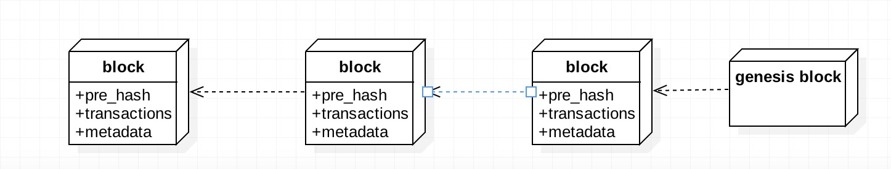

# 区块链

## 基本含义:
* 交易(Transaction): 一次操作,导致账本状态的一次变化,如添加一条记录;
* 区块(block): 记录一段时间内发生的交易和状态结果,是对当前账本状态的一次共识;
* 链(chain): 由一个个区块按照发生顺序串联而成,是整个状态变化的日志记录.

## 区块链结构:

## 密码学技术
* 如何防止交易记录被篡改?  

* 如何证明交易方的身份?  

* 如何保护交易双方的隐私?  

#### 密码学是提供解决这些问题的有效手段. 传统方案包括:  
 
* hash 算法  

* 加解密算法  

* 数字证书和签名(盲签名/环签名)